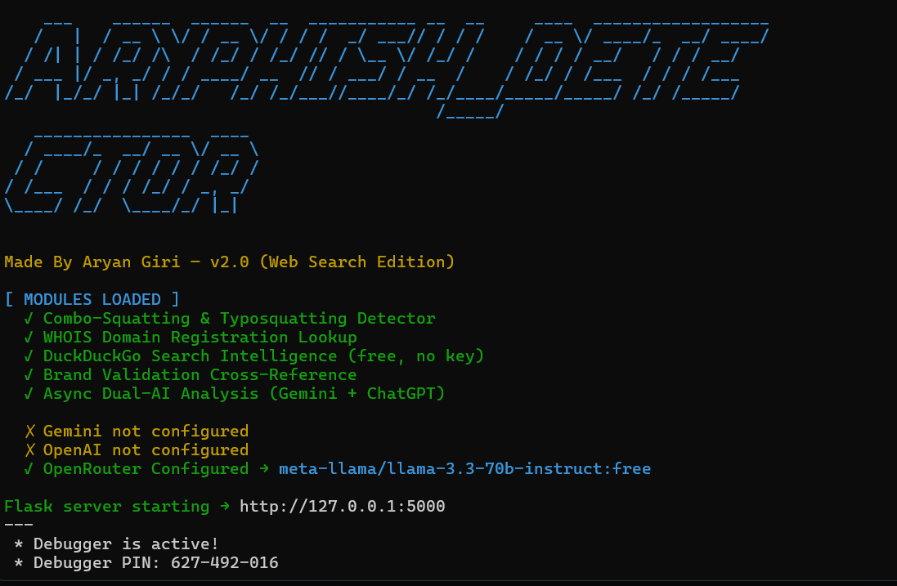

# ARYPHISH_DETECTOR

<div align="center">

### **Made by Aryan Giri**

<p>An intelligent web tool that uses the power of Google Gemini and OpenAI's ChatGPT to analyze URLs and detect phishing risks in real-time.</p>

<p>


</p>
</div>

---

## 🛑 The Problem: The "Human Firewall" is Fallible

Even well-trained employees who use VPNs, 2FA, and recognize basic attacks can still fall for **social engineering**. Attackers know that tricking a human is often easier than bypassing technical defenses. This is why phishing remains the **#1 attack vector** in real-world breaches.

---

## 🎯 What is Phishing?

Phishing is when attackers impersonate trusted entities to steal sensitive information such as:

* Login credentials
* Credit card information
* Personally identifiable data
* Corporate secrets

### Advanced Types of Phishing

* **Spear Phishing:** Targeted attacks using personal info to build trust.
* **Whaling:** Targeting executives and administrators.
* **Vishing:** Voice phishing through calls.
* **Smishing:** Phishing through SMS messages.
* **Quishing:** QR code phishing.

---

## 🛡️ The Solution: ARYPHISH_DETECTOR

Most URL filters rely on outdated databases. Human training helps, but it isn't perfect.

**ARYPHISH_DETECTOR acts as an AI-powered second opinion**, analyzing:

* Deceptive forms
* Fake login pages
* Obfuscated JavaScript
* Typosquatted domains
* Threatening or urgent language

It uses **multiple LLMs** to inspect a website in real time — a huge advantage over static tools.

---

## 📸 Screenshots



---

## 🚀 Features

* **Dual AI Mode:** Analyze URLs with *both* Gemini and ChatGPT.
* **Single AI Mode:** Choose your model.
* **Real-Time Content Fetching:** Fetches live HTML for deep inspection.
* **Clear Verdicts:** Simple "Safe" or "Phishing" output.
* **AI Reasoning:** Understand why the site is flagged.
* **Web-Based UI:** Clean interface built with Flask + Tailwind.
* **Stylish CLI:** pyfiglet banner on startup.

---

## 🛠️ How It Works

1. User enters a URL and chooses an AI model.
2. Frontend sends request to Flask backend.
3. Backend uses httpx to fetch live HTML.
4. AI receives structured prompt containing URL + source code.
5. AI returns JSON response with **Verdict** + **Reasoning**.
6. Frontend displays results using cards for Gemini and ChatGPT.

---

## ⚙️ Installation & Setup

### 1. Clone the Repository
```
git clone https://github.com/giriaryan694-a11y/ARYPHISH_DETECTOR.git
cd ARYPHISH-DETECTOR
```
### 2. Create and Activate Virtual Environment

Linux/macOS:

```
python -m venv venv
source venv/bin/activate
```

Windows:

```
python -m venv venv
.\venv\Scripts\activate
```

### 3. Install Dependencies

```
pip install -r requirements.txt
```

### 4. Add API Keys

Create a file named **keys.txt**:

```
GEMINI_API=YOUR_GEMINI_API_KEY_HERE
CHATGPT_API=YOUR_OPENAI_API_KEY_HERE
```

At least one API key is required.

### 5. Run the Server

```
python main.py
```

The banner appears, and the server starts.

---

## 🖥️ Usage

1. Open browser → [http://127.0.0.1:5000](http://127.0.0.1:5000)
2. Enter a URL.
3. Choose AI model.
4. Click **Analyze**.
5. View results.

---

## 💻 Tech Stack

* **Backend:** Python, Flask, httpx
* **AI Models:** Google Gemini, OpenAI ChatGPT
* **Frontend:** HTML, Tailwind CSS, Vanilla JS
* **CLI:** pyfiglet, colorama

---

## 📄 License

This project is licensed under the **Apache License 2.0**. See the `LICENSE` file for full license text.
