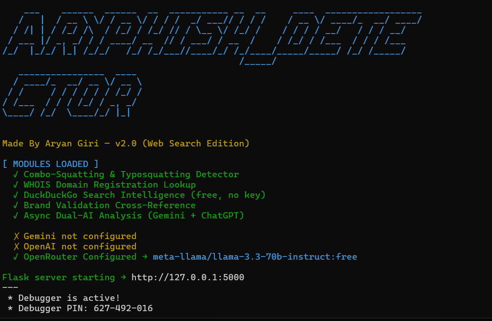
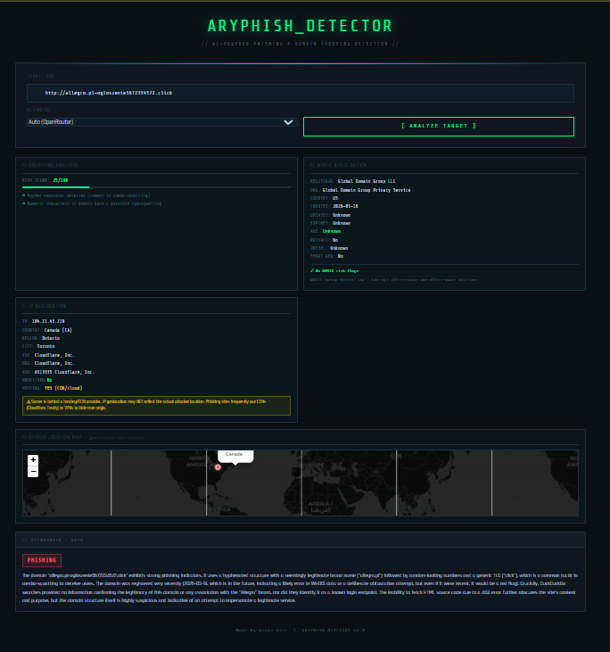

<div align="center">

```
 █████╗ ██████╗ ██╗   ██╗██████╗ ██╗  ██╗██╗███████╗██╗  ██╗
██╔══██╗██╔══██╗╚██╗ ██╔╝██╔══██╗██║  ██║██║██╔════╝██║  ██║
███████║██████╔╝ ╚████╔╝ ██████╔╝███████║██║███████╗███████║
██╔══██║██╔══██╗  ╚██╔╝  ██╔═══╝ ██╔══██║██║╚════██║██╔══██║
██║  ██║██║  ██║   ██║   ██║     ██║  ██║██║███████║██║  ██║
╚═╝  ╚═╝╚═╝  ╚═╝   ╚═╝   ╚═╝     ╚═╝  ╚═╝╚═╝╚══════╝╚═╝  ╚═╝
              D E T E C T O R  —  v2.1
```

**AI-Powered Phishing & Domain Spoofing Detection**

[](https://python.org)
[](https://flask.palletsprojects.com)
[](LICENSE)
[](https://github.com/giriaryan694-a11y)

> ⚡ **Works with zero budget** — OpenRouter provides free LLM access with no credit card needed.<br>
> 🔄 **Smart fallback chain** — if one free model is rate-limited or dead, automatically tries the next.

</div>

---

## 🧠 What Is This?

**ARYPHISH_DETECTOR** is a multi-engine AI phishing detection tool that analyzes URLs for domain spoofing, combo-squatting, typosquatting, and phishing signals. It combines static domain analysis, live WHOIS lookups, DuckDuckGo search intelligence, and parallel AI verdict generation — all through a sleek terminal-styled web UI.

Unlike static blocklist tools, ARYPHISH_DETECTOR **fetches and analyzes the live page in real time**, giving AI models full context: HTML source, domain registration data, and web search intelligence — all in one enriched prompt.

---

## 🛑 The Problem

Even well-trained users with VPNs and 2FA can fall for **social engineering**. Attackers know tricking a human is often easier than bypassing technical defenses. Phishing remains the **#1 attack vector** in real-world breaches.

### Attack Types This Tool Detects

| Attack | Example |
|--------|---------|
| **Combo-squatting** | `paypal-login.net`, `google-security.com` |
| **Typosquatting** | `g00gle.com`, `paypai.com`, `rnyspace.com` |
| **Subdomain abuse** | `login.paypal.com.evil.xyz` |
| **Homograph / IDN** | Unicode lookalike characters in domain |
| **Brand impersonation** | Page claims to be PayPal but domain has no relation |
| **Newly registered domains** | Domains < 6 months old are flagged high-risk |

---

## ✨ Features

| Module | Description |
|--------|-------------|
| 🔍 **Combo-Squatting Detector** | Matches 60+ known brands + 30+ suspicious keywords against the domain |
| 🔎 **Typosquatting Analysis** | Catches numeric injections, hyphens, deep subdomains, Unicode homographs |
| 📋 **WHOIS Lookup** | Registration date, registrar, country — flags domains under 6 months old |
| 🌐 **DuckDuckGo Search Intel** | 3 parallel searches: reputation, phishing/fraud reports, brand validation |
| 🤖 **Gemini AI** | Google Gemini 2.5 Flash (free tier available) |
| 🤖 **ChatGPT** | OpenAI GPT-4o-mini (paid) |
| 🤖 **OpenRouter (Free 🆓)** | Smart fallback chain across 6 free models — never gets stuck |
| 📊 **Risk Score Bar** | Visual 0–100 combo-squatting risk meter in the UI |
| 🖥️ **Terminal UI** | Dark hacker-aesthetic dashboard, responsive for desktop & mobile |

---

## 📸 Screenshots

<div align="center">

| Input & Analysis | Results |
|:---:|:---:|
|  |  |

</div>

---

## 🚀 Quick Start

```bash
# 1. Clone
git clone https://github.com/giriaryan694-a11y/ARYPHISH_DETECTOR.git
cd ARYPHISH_DETECTOR

# 2. Virtual environment (recommended)
python -m venv venv
source venv/bin/activate        # Linux / macOS
venv\Scripts\activate           # Windows

# 3. Install dependencies
pip install -r requirements.txt

# 4. Add your API key (free — takes 30 seconds)
#    Sign up at https://openrouter.ai → Keys → Create Key
nano keys.txt                   # paste your OPENROUTER_API key

# 5. Run
python main.py
# → Open http://127.0.0.1:5000
```

---

## 🔑 API Keys

Edit `keys.txt` — **at least one key is required**.

```ini
# Free — no credit card needed (recommended)
OPENROUTER_API=your_openrouter_key_here

# Free tier available
GEMINI_API=your_gemini_key_here

# Paid only
CHATGPT_API=your_openai_key_here

# Optional: pin a specific OpenRouter model (default: auto)
# OPENROUTER_MODEL=google/gemma-3-27b-it:free
```

### Provider Comparison

| Provider | Cost | Best For |
|----------|------|----------|
| **OpenRouter** | ✅ Free (no card) | Everyone — especially zero-budget setups |
| **Google Gemini** | ✅ Free tier | Good quality + free daily quota |
| OpenAI ChatGPT | 💳 Paid | Highest capability, costs money |

---

## 🔄 OpenRouter Free Model Fallback Chain

ARYPHISH_DETECTOR automatically tries models in this order if one fails (429 rate-limit, 404 dead endpoint, 503 upstream error):

```
1. openrouter/auto                          ← OpenRouter's own smart router (never 404s)
2. meta-llama/llama-3.3-70b-instruct:free   ← Llama 3.3 70B
3. google/gemma-3-27b-it:free               ← Gemma 3 27B
4. mistralai/mistral-7b-instruct:free        ← Mistral 7B
5. qwen/qwen3-8b:free                       ← Qwen3 8B
6. microsoft/phi-3-mini-128k-instruct:free   ← Phi-3 Mini
```

The UI card header shows **which model actually answered**, e.g. `// OPENROUTER — GEMMA-3-27B-IT:FREE`.

Retried automatically on:
- `429` — rate limited
- `404` — model deprecated / no endpoints
- `503` / `502` — upstream provider down
- Empty response — model returned blank content

---

## 🏗️ How It Works

```
URL Input
   │
   ├─► [1] Combo-Squatting Detector
   │       └─ 60+ brands + 30+ keywords → Risk Score 0–100
   │
   ├─► [2] WHOIS Lookup
   │       └─ Registration age, registrar, country
   │
   ├─► [3] DuckDuckGo Search Intelligence (free, no key)
   │       ├─ Domain reputation search
   │       ├─ Phishing / fraud report search
   │       └─ Brand official domain validation
   │
   ├─► [4] HTML Source Fetch  (async httpx)
   │
   └─► [5] AI Analysis  (parallel async)
           ├─ Gemini 2.5 Flash
           ├─ GPT-4o-mini
           └─ OpenRouter (auto-fallback chain)
                   │
                   ▼
           Verdict: Safe / Phishing / Suspicious
           + One-paragraph reasoning with full context
```

All modules run **concurrently** via `asyncio`. Total analysis time: ~5–15 seconds.

---

## 🔬 Risk Scoring

| Signal Detected | Score |
|----------------|-------|
| Known brand name in domain | +40 |
| Suspicious keyword (login, verify, payment…) | +30 |
| Non-ASCII / Unicode characters (homograph) | +25 |
| Hyphen separator in domain | +15 |
| Numeric characters in domain base | +10 |
| Deep subdomain structure (4+ levels) | +10 |

Scores ≥ 30 are flagged suspicious. All signals are fed to the AI for final verdict.

---

## 💻 Tech Stack

| Layer | Technology |
|-------|-----------|
| Backend | Python 3.9+, Flask, asyncio |
| HTTP | httpx (async) |
| AI engines | Gemini, OpenAI, OpenRouter |
| Search | duckduckgo-search (free, no key) |
| WHOIS | python-whois |
| Frontend | HTML, Tailwind CSS, Vanilla JS |
| CLI | pyfiglet, colorama |

---

## 📁 Project Structure

```
ARYPHISH_DETECTOR/
├── main.py             # Main app — Flask + all detection modules
├── keys.txt            # API keys ⚠️ never commit real keys
├── requirements.txt    # Python dependencies
├── docs/               # Documentation assets
├── screenshots/        # UI screenshots
├── LICENSE             # Apache 2.0
└── README.md           # This file
```

---

## ⚠️ Security Notice

**Never commit real API keys to a public repository.**

Add this to your `.gitignore`:

```gitignore
keys.txt
__pycache__/
*.pyc
venv/
.env
```

---

## 🗺️ Roadmap

- [ ] VirusTotal API integration for URL reputation scoring
- [ ] Screenshot capture of analyzed pages (Playwright)
- [ ] Export reports as PDF / JSON
- [ ] Batch URL analysis from CSV input
- [ ] Browser extension wrapper
- [ ] Discord / Telegram bot integration
- [ ] Docker support

---

## 📄 License

Licensed under the **Apache License 2.0**. See [`LICENSE`](LICENSE) for full text.

---

## ⚠️ Disclaimer

This tool is intended for **educational and authorized security research purposes only**. Only analyze URLs you have explicit permission to test. The author is not responsible for misuse.

---

<div align="center">

**ARYPHISH_DETECTOR v2.1 — Made By Aryan Giri**

*"Built for the ones with empty pockets and full curiosity."*

⭐ Star the repo if it helped you!

</div>
